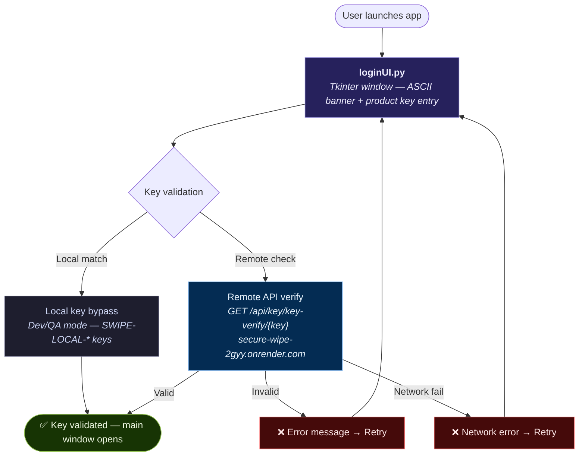
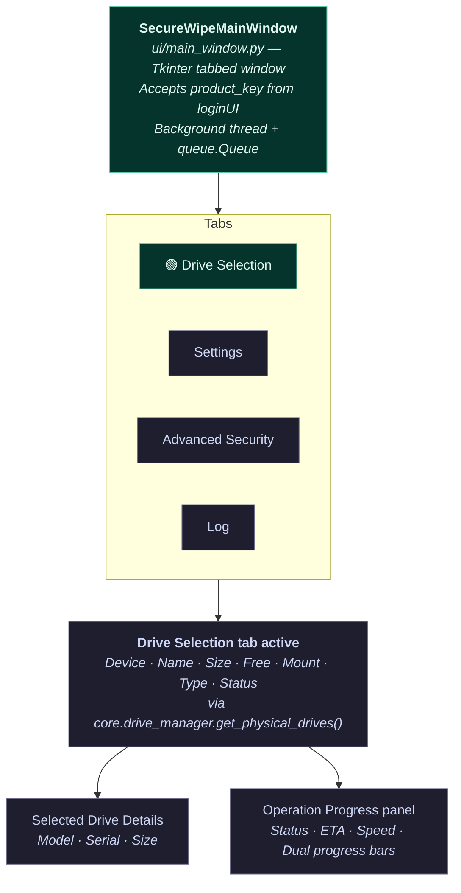
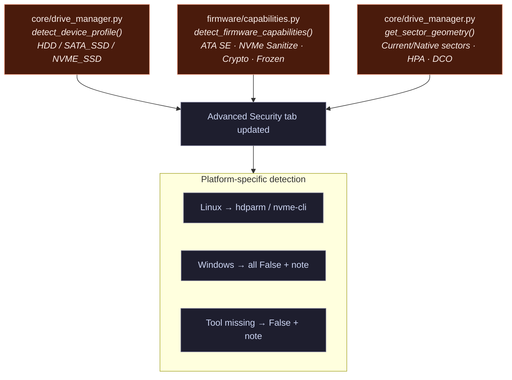
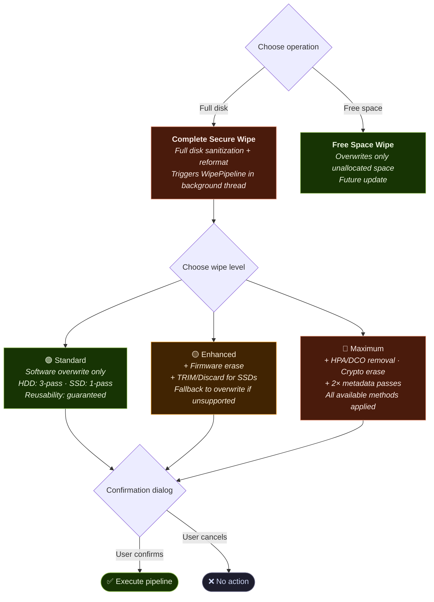
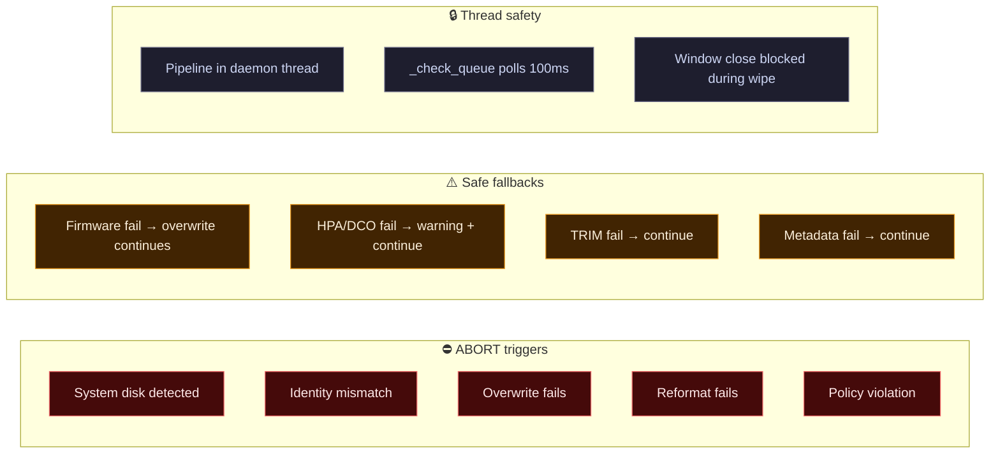
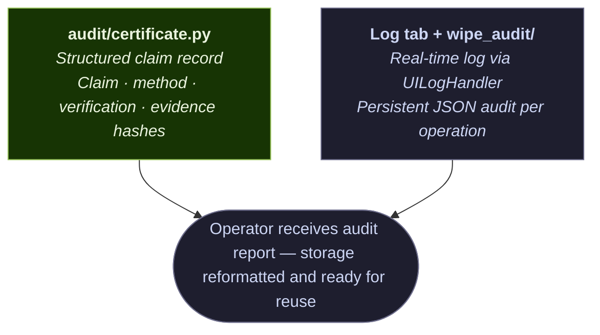
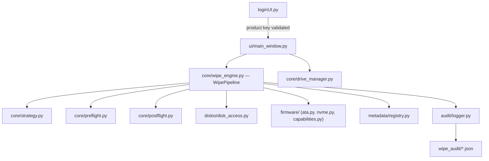

# Secure Wipe

## Download and Signup

Link for downloading Secure Wipe application EXE file:
https://drive.google.com/file/d/1A2aOaQh2xGl2DtMclJ1Mxua6sTq49-L3/view

Secure Wipe browser (for signup and product key):
https://secure-wipe.pages.dev/

Secure Wipe is a Python-based secure data sanitization application with:

- A desktop GUI (Tkinter) with modular tab-based interface
- An 11-step wipe pipeline with policy-gated operations
- Three sanitization depth levels: **Standard**, **Enhanced**, **Maximum**
- Firmware-level erase support (ATA Secure Erase, NVMe Sanitize)
- Structured JSON audit reports for every operation
- Plugin-based filesystem metadata wiping (NTFS, ext4, FAT)

The project is designed to help operators sanitize storage media and produce traceable records for compliance and audit workflows.

## Quick Start (60 Seconds)

Use this if you want to run Secure Wipe quickly on Windows.

1. If you are using the packaged build, open `SecureWipe.exe`. If you are running from source, stay in the repository root and use `python main.py`.
2. If you are using the packaged build, launch `SecureWipe.exe` and run it as **Administrator**. If you are running from source, start the app with `python main.py` from the repository root.
3. Enter your product key in the login window.
4. Select the correct target drive.
5. Choose a wipe level in the **Settings** tab:
   - **Standard** — software overwrite only
   - **Enhanced** — adds firmware erase when supported
   - **Maximum** — all methods including HPA/DCO removal
6. Click **Complete Secure Wipe** and confirm the destructive operation.
7. After successful completion, review the generated audit report.

> **Important**: Always double-check the selected drive before starting. Wipe and format operations are **irreversible and destructive**.

## Table of Contents

- [Quick Start (60 Seconds)](#quick-start-60-seconds)
- [What This Project Does](#what-this-project-does)
- [Core Features](#core-features)
- [Wipe Levels](#wipe-levels)
- [Application Workflow](#application-workflow)
- [Architecture](#architecture)
- [Folder Structure](#folder-structure)
- [Module Reference](#module-reference)
- [Execution Pipeline (11 Steps)](#execution-pipeline-11-steps)
- [Setup and Installation](#setup-and-installation)
- [Safety Notes](#safety-notes)
- [Troubleshooting](#troubleshooting)

## What This Project Does

Secure Wipe sanitizes storage devices using a strategy-driven pipeline that automatically selects the best method for each device:

- **Software overwrite** — multi-pass raw disk writes (random, zeroes, ones)
- **Firmware erase** — ATA Secure Erase, NVMe Sanitize, NVMe Format
- **Hidden area handling** — HPA expansion and DCO restoration (Linux/hdparm)
- **TRIM/Discard** — for SSDs on Linux via `blkdiscard`
- **Metadata destruction** — filesystem-specific metadata wiping via plugin system
- **Reformat** — always executed to guarantee device reusability
- **Audit logging** — JSON reports saved to `wipe_audit/` for every operation

## Core Features

- GUI-driven disk operations (drive discovery, settings, progress, logs)
- Policy-gated operation system (`MODE_POLICIES` per wipe level)
- Capability-based strategy selection (detects what hardware supports)
- Safe fallback pattern (firmware failure → software overwrite continues)
- System disk protection (preflight blocks wiping the OS drive)
- Thread-safe UI updates (daemon thread + queue polling)
- Cross-platform support (Windows, Linux, macOS)

## Wipe Levels

| Level | Operations | HDD Passes | SSD Passes | Firmware | HPA/DCO | Metadata |
|-------|-----------|-----------|-----------|----------|---------|----------|
| **Standard** | Overwrite + Format | 3 | 1 | ❌ | ❌ | 1 pass |
| **Enhanced** | + ATA SE / NVMe Sanitize / TRIM | 3 | 1 | ✅ if supported | ❌ | 1 pass |
| **Maximum** | + HPA/DCO removal + Crypto erase | 3 | 1 | ✅ all available | ✅ | 2 passes |

> All levels **guarantee device reusability** — the drive is always reformatted at the end.

---

## Application Workflow

### 1 — Authentication



### 2 — Main Interface



### 3 — Capability Detection (on drive select)



> Capabilities **inform strategy** but **never block** execution. Unsupported features fall back to software overwrite.

### 4 — Operation Selection



### 5 — Wipe Engine (11-Step Pipeline)

```mermaid
flowchart TD
    P["<b>WipePipeline</b>(disk_path, execution_plan, callback)<br><i>core/wipe_engine.py — orchestrates all steps<br>normalize_execution_plan&lpar;&rpar; → MODE_POLICIES gate</i>"] --> S1

    S1["Step 1: <b>Preflight Validation</b> ⛔ MANDATORY<br><i>core/preflight.py — system disk protection<br>mount check · identity verify · Failure = ABORT</i>"] --> S2

    S2["Step 2: <b>Device Profiling</b><br><i>detect_device_profile&lpar;&rpar; + detect_firmware_capabilities&lpar;&rpar;</i>"] --> S3
    S3["Step 3: <b>Strategy Selection</b><br><i>choose_wipe_strategy&lpar;&rpar; — firmware vs overwrite decision</i>"] --> GATE

    GATE["<b>Execution plan + policy gate</b><br><i>build_execution_plan&lpar;&rpar; — allowed-ops list<br>is_operation_allowed&lpar;&rpar; · enforce_operation_allowed&lpar;&rpar;</i>"] --> S4

    S4["Step 4: <b>HPA/DCO</b> ⚠️ OPTIONAL<br><i>MAX only · firmware/ata.py<br>expand_hpa · restore_dco</i>"] --> S5
    S5["Step 5: <b>Firmware Erase</b> ⚠️ OPTIONAL<br><i>ENH+MAX · ATA SE · NVMe Sanitize<br>NVMe Format · Crypto</i>"] --> S6
    S6["Step 6: <b>TRIM</b> ⚠️ OPTIONAL<br><i>SSD only · blkdiscard · Linux only</i>"] --> S7

    S7["Step 7: <b>Overwrite Passes</b> ⛔ MANDATORY<br><i>diskio/disk_access.py · write_to_raw_disk&lpar;&rpar; × N<br>Failure = ABORT</i>"] --> S8
    S8["Step 8: <b>Metadata Wipe</b> ⚠️ OPTIONAL<br><i>metadata/registry.py · Plugin-based<br>NTFS · ext4 · FAT</i>"] --> S9
    S9["Step 9: <b>Verification</b> ⚠️ OPTIONAL<br><i>Sector read-back check</i>"] --> S10

    S10["Step 10: <b>Reformat</b> ⛔ MANDATORY<br><i>core/formatter.py — diskpart / mkfs / diskutil<br>Failure = ABORT — reusability broken</i>"] --> S11

    S11["Step 11: <b>Postflight Validation</b><br><i>core/postflight.py — geometry check · HPA/DCO recheck<br>run_reusability_test&lpar;&rpar; — partition + mount + probe</i>"] --> CLAIM

    CLAIM["<b>Claim level computed</b><br><i>core/claim_model.py<br>DATA_OVERWRITTEN · MAX_PRACTICAL_UNRECOVERABILITY<br>COMPREHENSIVE_SANITIZATION · INCOMPLETE_OR_UNVERIFIED</i>"] --> REPORT

    REPORT["<b>Wipe audit report saved</b><br><i>audit/logger.py → wipe_audit/wipe_report_{uuid}.json<br>device · method · all step results · claim · timestamps</i>"]

    style P fill:#042C53,stroke:#85B7EB,color:#E6F1FB
    style S1 fill:#26215C,stroke:#AFA9EC,color:#EEEDFE
    style S2 fill:#1e1e2e,stroke:#6c6c8a,color:#cdd6f4
    style S3 fill:#1e1e2e,stroke:#6c6c8a,color:#cdd6f4
    style GATE fill:#042C53,stroke:#85B7EB,color:#E6F1FB
    style S4 fill:#04342C,stroke:#5DCAA5,color:#E1F5EE
    style S5 fill:#04342C,stroke:#5DCAA5,color:#E1F5EE
    style S6 fill:#04342C,stroke:#5DCAA5,color:#E1F5EE
    style S7 fill:#042C53,stroke:#85B7EB,color:#E6F1FB
    style S8 fill:#04342C,stroke:#5DCAA5,color:#E1F5EE
    style S9 fill:#04342C,stroke:#5DCAA5,color:#E1F5EE
    style S10 fill:#042C53,stroke:#85B7EB,color:#E6F1FB
    style S11 fill:#1e1e2e,stroke:#6c6c8a,color:#cdd6f4
    style CLAIM fill:#26215C,stroke:#AFA9EC,color:#EEEDFE
    style REPORT fill:#042C53,stroke:#85B7EB,color:#E6F1FB
```



> ⚠️ **Optional steps**: failure → warning logged → pipeline continues  
> ⛔ **Mandatory steps**: failure → pipeline **ABORT**

### 6 — Error & Safety Handling



> Audit report is **always saved** (even on failure). UI **never freezes**. Capabilities default to `False` on error.

### 7 — Output and Reporting



---

## Architecture



### Dependency Rules

```
utils/     → imports nothing (pure leaf)
diskio/    → imports only utils/
firmware/  → imports only utils/ (exception: capabilities.py imports core.drive_manager)
metadata/  → imports only utils/ and diskio/
audit/     → imports only utils/
core/      → imports all of the above
ui/        → imports only core/ and utils/
```

## Folder Structure

```text
Secure-Wipe/
├── main.py                  Entry point → launches loginUI
├── loginUI.py               Product key login window
├── requirements.txt         Python dependencies
├── core/                    Core engine modules
│   ├── wipe_engine.py       WipePipeline orchestrator (11-step pipeline)
│   ├── strategy.py          Strategy selection + execution plan builder
│   ├── drive_manager.py     Drive enumeration via Get-Disk/lsblk (all disks)
│   ├── preflight.py         Safety checks before destructive operations
│   ├── postflight.py        Verification after wipe + reusability test
│   ├── formatter.py         Cross-platform disk reformatting
│   └── claim_model.py       Sanitization claim level computation
├── ui/                      Tkinter GUI modules
│   ├── main_window.py       Main window + tab container + thread coordinator
│   └── tabs/
│       ├── drive_selection.py   Drive list, buttons, progress bars
│       ├── settings.py          Wipe level + overwrite configuration
│       ├── advanced_security.py Device profile + firmware capabilities
│       └── log.py               Real-time log output
├── firmware/                Firmware-level operations (leaf module)
│   ├── ata.py               ATA Secure Erase, HPA/DCO — Linux/hdparm
│   ├── nvme.py              NVMe Sanitize/Format — Linux/nvme-cli
│   └── capabilities.py      Hardware capability detection
├── diskio/                  Raw disk I/O (leaf module)
│   └── disk_access.py       Win32 CreateFileW / Unix r+b raw writes
├── metadata/                Filesystem metadata wipers (plugin system)
│   ├── base.py              MetadataWiperPlugin ABC interface
│   ├── registry.py          Plugin registry + entry point
│   ├── ntfs.py              NTFS metadata wiper
│   ├── ext4.py              ext4 metadata wiper
│   └── fat.py               FAT metadata wiper
├── audit/                   Audit and reporting
│   ├── logger.py            Structured JSON report creation/persistence
│   └── certificate.py       Destroy workflow records (legacy compat)
├── utils/                   Pure utility functions (leaf module)
│   ├── constants.py         All enums, policies, operation names, profiles
│   ├── system.py            is_admin(), command_exists()
│   └── formatting.py        format_size(), parse_size(), format_time()
└── wipe_audit/              Generated audit reports (JSON)
```

## Module Reference

### Core Modules

| Module | Purpose | Key Functions |
|--------|---------|---------------|
| `core/wipe_engine.py` | Pipeline orchestrator | `WipePipeline`, `WipeProgress`, `WipeResult` |
| `core/strategy.py` | Decides what to do | `choose_wipe_strategy()`, `build_execution_plan()` |
| `core/drive_manager.py` | Drive enumeration (Get-Disk/lsblk) | `get_physical_drives()`, `get_disk_identity()` |
| `core/preflight.py` | Safety checks + unmount | `run_preflight_validation()`, `prepare_disk_unmounted_state()` |
| `core/postflight.py` | Post-wipe verification | `run_postflight_validation()`, `run_reusability_test()` |
| `core/formatter.py` | Disk reformatting | `build_windows_diskpart_commands()` |
| `core/claim_model.py` | Claim computation | `determine_claim_level()`, `build_claim_result()` |

### Leaf Modules

| Module | Purpose | Key Functions |
|--------|---------|---------------|
| `firmware/ata.py` | ATA operations | `run_secure_erase_with_interrupt_lock()` |
| `firmware/nvme.py` | NVMe operations | `run_nvme_sanitize_with_interrupt_lock()` |
| `firmware/capabilities.py` | Hardware detection | `detect_firmware_capabilities()` |
| `diskio/disk_access.py` | Raw disk I/O | `write_to_raw_disk()` (Win32 CreateFileW / Unix r+b) |
| `metadata/registry.py` | Metadata wiping | `wipe_filesystem_metadata()` |
| `audit/logger.py` | Audit reports | `create_execution_report()`, `save_execution_report()` |

## Execution Pipeline (11 Steps)

| # | Step | Type | Module | Failure Behavior |
|---|------|------|--------|-----------------|
| 1 | Preflight Validation | ⛔ Mandatory | `core/preflight.py` | ABORT — system disk / identity mismatch |
| 2 | Device Profiling | Mandatory | `core/drive_manager.py` | ABORT |
| 3 | Strategy Selection | Mandatory | `core/strategy.py` | ABORT |
| 4 | HPA/DCO Removal | ⚠️ Optional | `firmware/ata.py` | Warning + continue |
| 5 | Firmware Erase | ⚠️ Optional | `firmware/ata.py` / `nvme.py` | Warning + continue (fallback to overwrite) |
| 6 | TRIM/Discard | ⚠️ Optional | `subprocess` (blkdiscard) | Warning + continue |
| 7 | Overwrite Passes | ⛔ Mandatory | `diskio/disk_access.py` | ABORT |
| 8 | Metadata Wipe | ⚠️ Optional | `metadata/registry.py` | Warning + continue |
| 9 | Verification | ⚠️ Optional | stub | Warning + continue |
| 10 | Reformat | ⛔ Mandatory | `core/formatter.py` | ABORT — reusability broken |
| 11 | Postflight Validation | Mandatory | `core/postflight.py` | Sets final status |

## Setup and Installation

### Prerequisites

- Python 3.10+
- Administrator/root privileges for disk operations
- Windows, Linux, or macOS

### 1) Clone repository

```bash
git clone <your-repo-url>
cd Secure-Wipe
```

### 2) Create and activate virtual environment

**Windows (PowerShell)**
```powershell
python -m venv venv
.\venv\Scripts\activate
```

**Linux/macOS**
```bash
python3 -m venv venv
source venv/bin/activate
```

### 3) Install dependencies

```bash
pip install -r requirements.txt
```

### 4) Run the application

```bash
python main.py
```

## Safety Notes

- Disk operations are **destructive**. Test on non-critical media first.
- Always verify the target device before starting a wipe.
- The system disk is **automatically protected** — preflight validation blocks it.
- Some firmware operations require **Linux** and specific tools (`hdparm`, `nvme-cli`).
- On Windows/macOS, firmware capabilities return `False` and the system falls back to software overwrite.
- Wipe levels differ only in **depth of sanitization** — all levels guarantee **device reusability**.
- This tool provides operational assurance and auditability, not a legal guarantee for every forensic context.

## Troubleshooting

| Problem | Solution |
|---------|----------|
| Permission denied / access errors | Run as Administrator (Windows) or `sudo` (Linux/macOS) |
| "Software overwrite failed on pass 1" | Must run as Administrator. The app uses Win32 `CreateFileW` for raw disk access which requires elevation. |
| "target disk has mounted partitions" | The app auto-unmounts, but needs Administrator. Alternatively, eject/safely remove the drive manually first. |
| Drive not listed | Click Refresh Drives. Uses `Get-Disk` on Windows — same source as Disk Management. If a disk shows in Disk Management it should appear here. |
| Disk shows but has no drive letter | Normal — the app detects all physical disks including raw/uninitialized/offline/letterless disks. Status column shows the state. |
| API/key verification issues | Check internet connectivity. Validate API endpoint availability. |
| Firmware erase skipped | Check Advanced Security tab. Drive may be frozen or tool missing. |
| Format fails on Windows | Ensure no other programs hold the volume. Try again. |
| UI freezes | Should not happen (daemon thread). Check Log tab for errors. |

## Reference Links

- Web portal: https://secure-wipe.pages.dev/
- Verify page: https://secure-wipe.pages.dev/verify
